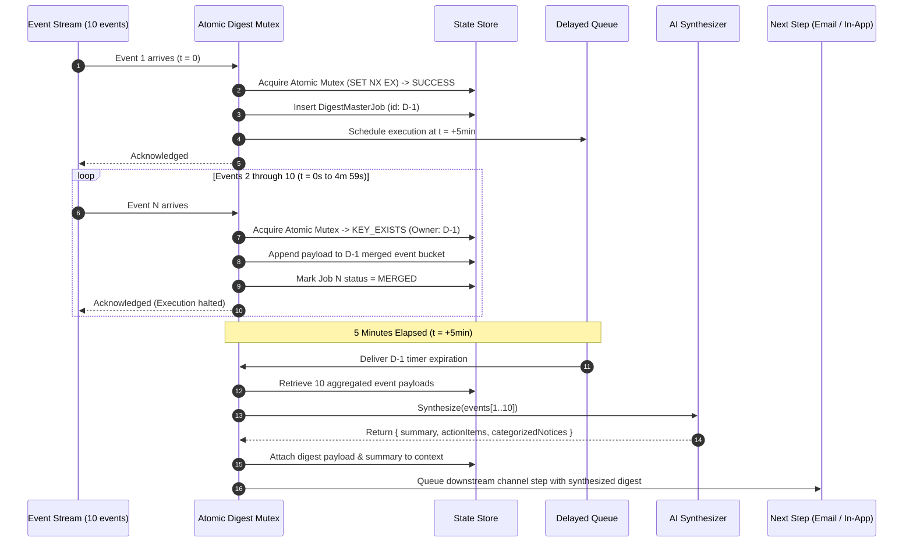
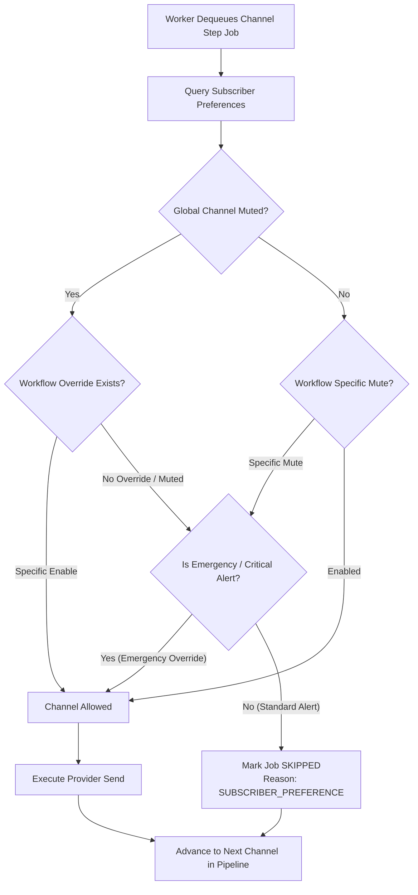
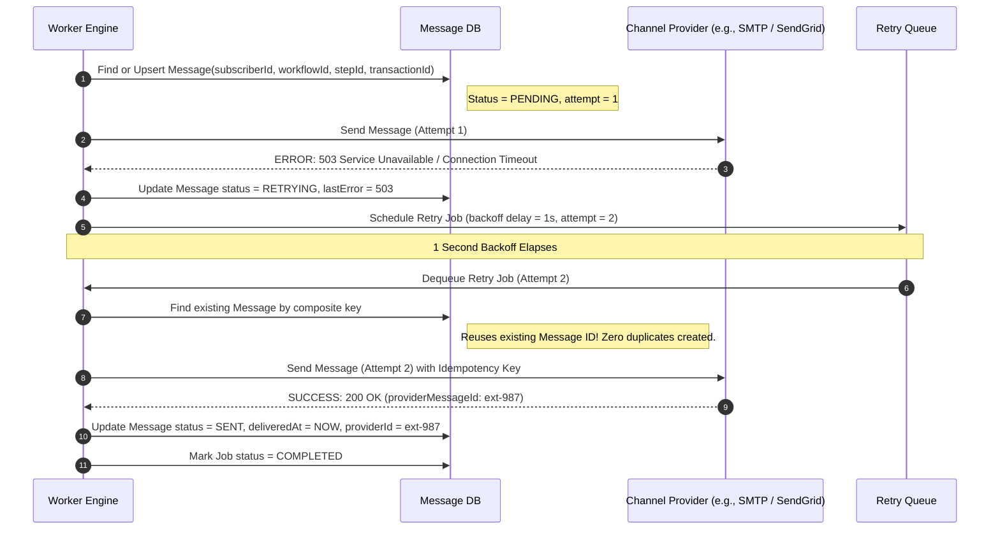

# Clean-Room System Architecture: Campus Notification Engine

## 1. Architectural Overview & Boundaries
The Clean-Room Notification Engine is a high-throughput, event-driven notification orchestration platform designed to ingest high-frequency campus events, evaluate recipient preferences, batch event bursts through atomic digests, and reliably deliver messages across multiple channels (Email, In-App).

```
                      +-----------------------------+
                      |   Campus Dispatch Client    |
                      | (Admin Dashboard / Webhook) |
                      +--------------+--------------+
                                     |  HTTP POST /v1/events/trigger
                                     v
                      +-----------------------------+
                      |        API Gateway          |
                      |  - Idempotency Gatekeeper   |
                      |  - Schema Validation        |
                      +--------------+--------------+
                                     |  Enqueue
                                     v
                 +---------------------------------------+
                 |            Event Queue                |
                 | (Redis / BullMQ - Immediate & Delayed)|
                 +-------------------+-------------------+
                                     |
                                     v
                      +-----------------------------+
                      |       Worker Service        |
                      |  +-----------------------+  |
                      |  | 1. Recipient Fan-Out  |  |
                      |  +-----------------------+  |
                      |  | 2. Atomic Digest Eng. |  |
                      |  +-----------------------+  |
                      |  | 3. Preference Filter  |  |
                      |  +-----------------------+  |
                      |  | 4. Retry & Dispatch   |  |
                      |  +-----------------------+  |
                      +--------------+--------------+
                                     |
             +-----------------------+-----------------------+
             |                                               |
             v                                               v
+-------------------------+                     +-------------------------+
|     Email Provider      |                     |      In-App Storage     |
| (SMTP / SendGrid Mock)  |                     | (Subscriber Message DB) |
+-------------------------+                     +-------------------------+
```

---

## 2. "Observed in Original" vs. "Required for Clean-Room Rebuild"

| Architectural Aspect | Observed in Original (Novu) | Required for Clean-Room Rebuild | Rationale |
|---|---|---|---|
| **Service Topologies** | 7 standalone apps (`api`, `worker`, `ws`, `webhook`, `dashboard`, etc.) in heavy monorepo. | Streamlined unified API + Background Worker topology (modular within a single cleanly architected project). | Drastically reduces devops overhead, eliminates network microservice serialization hops, perfectly suited for standalone hackathon deployment. |
| **Queue Topology** | BullMQ layered over Redis with conditional SQS fallback; multiple separated queues (`workflow`, `subscriber-process`, `standard`). | BullMQ/Redis with 2 core queues: `workflow-jobs` (immediate orchestration) and `delayed-jobs` (digest/delay timers). | Preserves clean separation between immediate execution and deferred digest timers without superfluous inter-queue handoffs. |
| **Digest Window State** | Query-then-write in Mongo ([merge-or-create-digest.usecase.ts:161-177](file:///Users/ishanverma/Desktop/Debug_Hack/novu/apps/worker/src/app/workflow/usecases/add-job/merge-or-create-digest.usecase.ts#L161-L177)); vulnerable to concurrent master election race conditions. | **Atomic Digest Window Mutex** via Redis `SET NX EX` or atomic MongoDB find-and-modify on a dedicated `digest_windows` state collection. | Eliminates TOCTOU race conditions; guarantees exactly 1 digest master even under concurrent burst triggers. |
| **Preference Evaluation** | Multi-level hierarchy (Workflow Resource -> Subscriber Global -> Subscriber Workflow -> User Workflow) with runtime MongoDB lookups. | Direct subscriber preference model: Global channel preferences + Workflow channel overrides, resolved synchronously in-memory per job. | Fully implements Killer Test 2 (Muted email -> in-app only) with sub-millisecond evaluation speed and zero unnecessary database joins. |
| **Provider Retries** | Channel delivery errors immediately fail ([send-message-email.usecase.ts:683-732](file:///Users/ishanverma/Desktop/Debug_Hack/novu/apps/worker/src/app/workflow/usecases/send-message/send-message-email.usecase.ts#L683-L732)); retries are strictly restricted to webhook filters ([run-job.usecase.ts:899-901](file:///Users/ishanverma/Desktop/Debug_Hack/novu/apps/worker/src/app/workflow/usecases/run-job/run-job.usecase.ts#L899-L901)). | Universal exponential backoff retry loop on channel provider dispatch (attempts: 3, backoff: 1s, 5s, 15s). | Fulfills Killer Test 3: resilient recovery from transient network/provider failures. |
| **Message Deduplication** | Asymmetric: In-app checks `oldMessage` ([send-message-in-app.usecase.ts:175](file:///Users/ishanverma/Desktop/Debug_Hack/novu/apps/worker/src/app/workflow/usecases/send-message/send-message-in-app.usecase.ts#L175)), but Email blindly creates new records on every run ([send-message-email.usecase.ts:207](file:///Users/ishanverma/Desktop/Debug_Hack/novu/apps/worker/src/app/workflow/usecases/send-message/send-message-email.usecase.ts#L207)). | Universal idempotent message upsert keyed by deterministic composite identity `(subscriberId, workflowId, stepId, transactionId)`. | Guarantees zero duplicate database records or notifications across all channels during retries. |
| **Digest Content Synthesis** | Plain array concatenation of raw JSON payloads into `step.digest.events` ([digest.usecase.ts:80-92](file:///Users/ishanverma/Desktop/Debug_Hack/novu/apps/worker/src/app/workflow/usecases/send-message/digest/digest.usecase.ts#L80-L92)). | **AI-Powered Smart Digest Synthesizer** generating an executive TL;DR, prioritized action items, and categorical groupings before dispatch. | Solves real-world campus notification fatigue; delivers our chosen killer differentiator. |

---

## 3. Component Architecture & Responsibilities

### 3.1 Ingestion API Gateway
- **Endpoint**: `POST /v1/events/trigger`
- **Responsibilities**:
  1. Authenticates client requests.
  2. Validates transaction idempotency: Checks cache for `transactionId`. If active or completed, returns previous acknowledgement without re-triggering.
  3. Validates event payload against expected schema.
  4. Generates a unique `transactionId` if omitted.
  5. Enqueues an orchestration task to `workflow-jobs` and immediately returns `202 Accepted` with `{ acknowledged: true, transactionId }`.

### 3.2 Workflow Orchestrator & Recipient Fan-Out
- **Responsibilities**:
  1. Resolves recipient list (single subscriber ID or expanded list).
  2. For each subscriber, initializes the workflow step pipeline (e.g., Step 0: Digest -> Step 1: Email -> Step 2: In-App).
  3. Chains steps sequentially via `parentId` pointers or step indices.
  4. Dispatches the first step to the execution engine.

### 3.3 Atomic Digest Engine (Killer Test 1 & Final Fix)
- **Responsibilities**:
  1. Intercepts `DIGEST` steps before message channels.
  2. Executes **Atomic Digest Window Mutex**:
     - Attempts to acquire an atomic window lease for `(subscriberId, workflowId, digestKey)`.
     - **If winner (First Event)**: Marks job as `DIGEST_MASTER`. Enqueues a delayed execution timer to BullMQ with `delay = windowDurationMs` (e.g., 5 minutes = 300,000ms).
     - **If loser (Subsequent Events 2-10)**: Merges event payload into the active window's event store. Marks job as `MERGED` and halts downstream execution for this event instance.
  3. **Timer Expiration**:
     - Pulls all merged event payloads for the active window.
     - Invokes the **AI Digest Synthesizer** to create a structured brief.
     - Injects `digest.events` and `digest.summary` into context and triggers downstream message steps.

### 3.4 Preference Engine (Killer Test 2)
- **Responsibilities**:
  1. Intercepts each channel message step prior to provider dispatch.
  2. Loads subscriber preferences for the specific channel (`email`, `in_app`).
  3. **Evaluation Logic**:
     - If `preferences.channels[channel] === false`:
       - Emits execution trace: `STEP_SKIPPED_SUBSCRIBER_PREFERENCE`.
       - Sets job status to `SKIPPED`.
       - Advances pipeline to the next channel step without invoking provider.
     - If `preferences.channels[channel] === true`:
       - Proceeds to message compilation and delivery.

### 3.5 Delivery Dispatcher & Idempotent Retry Engine (Killer Test 3)
- **Responsibilities**:
  1. **Deterministic Message Record**: Uses an atomic upsert on `Message` keyed by `(subscriberId, workflowId, stepId, transactionId)` with status `PENDING`.
  2. **Provider Dispatch**: Calls provider handler (Email SMTP / mock, In-App store) with an idempotency key.
  3. **Error Handling & Retries**:
     - If provider call succeeds: Marks `Message` and `Job` as `SENT` / `COMPLETED`.
     - If provider call fails with transient error:
       - Increments `attemptsMade`.
       - If `attemptsMade < maxAttempts`: Re-enqueues job with exponential delay (`delay = baseDelay * 2^(attempt - 1)`).
       - If `attemptsMade >= maxAttempts`: Marks `Job` and `Message` as `FAILED`.
     - Upon retry, the dispatcher reuses the existing `Message` record, ensuring zero duplicates.

---

## 4. End-to-End Workflow Execution Sequence

```mermaid
sequenceDiagram
    autonumber
    actor Client as Dispatch Client
    participant API as Ingestion API
    participant Q as Redis Queue
    participant W as Worker Engine
    participant DB as State Store (DB)
    participant Channel as Channel Provider

    Client->>API: POST /v1/events/trigger { workflowId, to, payload, transactionId }
    API->>DB: Check idempotency (transactionId)
    API->>Q: Enqueue workflow job
    API-->>Client: 202 Accepted { acknowledged: true, transactionId }

    Q->>W: Dequeue job for subscriber
    W->>DB: Create Notification & Job records

    rect rgb(240, 248, 255)
    note right of W: Step 1: Digest Evaluation
    W->>DB: Atomic window check (subscriberId, workflowId)
    alt First Event in Window (Digest Master)
        W->>Q: Schedule delayed job (delay: 5m)
    else Events 2-10 in Window (Merged)
        W->>DB: Store payload in digest window & set status: MERGED
        note right of W: Halts execution for merged events
    end
    end

    rect rgb(255, 250, 240)
    note right of W: After 5 min: Digest Timer Fires
    Q->>W: Dequeue master digest job
    W->>DB: Fetch all 10 merged event payloads
    W->>W: AI Synthesis (Generate TL;DR & Action Items)
    end

    rect rgb(245, 255, 245)
    note right of W: Step 2: Preference & Channel Dispatch
    W->>DB: Query subscriber preferences
    alt Email Channel Muted
        W->>DB: Record Email Step: SKIPPED (SUBSCRIBER_PREFERENCE)
    else Email Channel Enabled
        W->>Channel: Dispatch Email
    end

    W->>DB: In-App Channel Enabled -> Store in In-App Feed
    end
```

---

## 5. Digest Execution Flow (Killer Test 1 & Final Fix)



---

## 6. Preference Evaluation Architecture (Killer Test 2)



---

## 7. Retry & Idempotent Delivery Architecture (Killer Test 3)



---

## 8. Data Store Boundaries & Schemas
- **Primary Operational DB**: Stores static configuration (workflows, templates), persistent operational records (subscribers, preferences), and message entities (inbox feed).
- **In-Memory Cache & Message Broker (Redis)**:
  - Queue structures (BullMQ jobs, delayed timers).
  - Idempotency key cache (`idemp:<transactionId>` -> TTL 24h).
  - Atomic digest window mutexes (`lock:digest:<subscriberId>:<workflowId>` -> TTL 5m).
